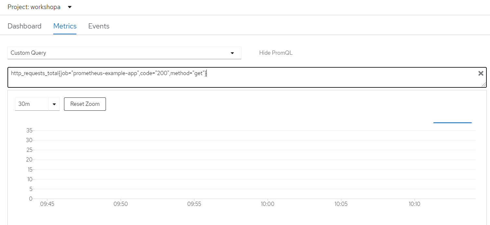

# prometheus application monitoring

So lets mix it up and actually use another container image.

## Task

- Setup the example prometheus app mentioned in the docs. (NO NEED TO CREATE A NEW NAMESPACE)
- Create a external route of the service to easily view the metrics endpoint
- Initiate scraping of the service endpoint
- Verify the scraping is working as intended from the UI

### Resources

You can find the official [docs](https://docs.openshift.com/container-platform/4.5/monitoring/monitoring-your-own-services.html#deploying-a-sample-service_monitoring-your-own-services)

If you are running OCP I assume that you have enabled monitroing of your own services.

### Tip

It might take a few minutes until the first scraping gets done.

### Verify

Look at the number of get requests your application have gotten.

curl $(oc get route prometheus-example-app -o go-template --template='{{.spec.host}}')/metrics

Remove /metrics and create some load on your endpoint

curl $(oc get route prometheus-example-app -o go-template --template='{{.spec.host}}')

Have a look at the metrics again.

#### Graph verification

If you want to look at the graph that your metrics generate.

From the OCP console. Developer -> Monitoring -> Metrics -> Show PromQL -> Enter the following string

`http_requests_total{job="prometheus-example-app",code="200",method="get"}`

You should see something like this:

Once again it might take some time for the metrics to show.
Always good to generate some extra metrics by hitting the endpoint.

## Command

### servicemonitor

oc get servicemonitor
